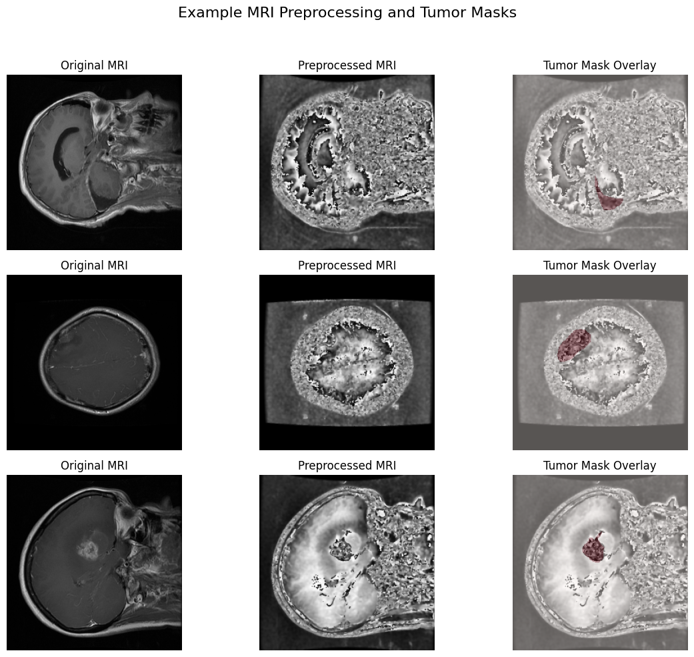
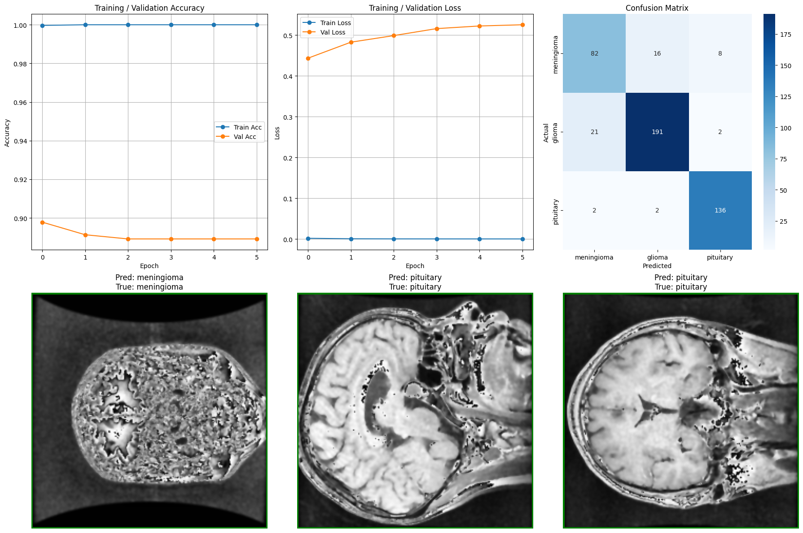
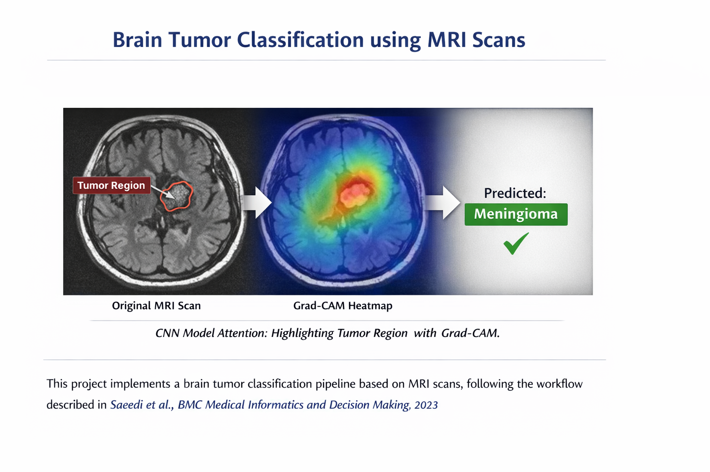

# Brain Tumor Classification using MRI Scans  

> This project implements a brain tumor classification pipeline based on MRI scans, **following the workflow described in**  
> **Saeedi et al., BMC Medical Informatics and Decision Making, 2023**  
> ([DOI](https://doi.org/10.1186/s12911-023-02114-6))

It includes:

- Data preprocessing and visualization  
- CNN-based feature extraction (DenseNet121)  
- Fully connected classifier training on deep features  
- Evaluation with accuracy, confusion matrix, and Grad-CAM attention maps  

---

## Table of Contents

1. [Paper Reference](#paper-reference)  
2. [Dataset](#dataset)  
3. [Preprocessing](#preprocessing)  
4. [Training](#training)  
5. [Evaluation](#evaluation)  
6. [Visualization](#visualization)  
7. [Requirements](#requirements)  
8. [Usage](#usage)  

---

## Paper Reference

**Title:** Brain Tumor Classification using Deep Learning on MRI Scans  
**Authors:** Saeedi et al.  
**Journal:** BMC Medical Informatics and Decision Making, 2023  
**DOI:** https://doi.org/10.1186/s12911-023-02114-6  

This project follows their **data preprocessing, CNN feature extraction, and classification methodology** to replicate and analyze the results.

---

## Example MRI Preprocessing and Tumor Masks

---

## Dataset

- **Source:** [Figshare Brain Tumor MRI Dataset](https://figshare.com/articles/dataset/Brain_Tumor_MRI/1512427)  
- **Format:** `.mat` files containing MRI images, tumor masks, and labels  
- **Tumor classes:**
  - `1` → Meningioma  
  - `2` → Glioma  
  - `3` → Pituitary  

**Dataset size:**  
3064 T1-weighted contrast-enhanced MRI images with three tumor types.

---

## Preprocessing

1. Resize images and masks to **224 × 224**  
2. Pixel normalization to **[0, 1]**  
3. Noise reduction and enhancement:
   - Median filtering  
   - Bilateral filtering  
   - CLAHE (Contrast Limited Adaptive Histogram Equalization)  
4. Train / Validation / Test split: **70% / 15% / 15%**  
5. Save processed images and masks as `.npy` and `.png`  

---

## Training

### DenseNet121 Transfer Learning

- Pretrained **DenseNet121** (ImageNet)
- Global Average Pooling  
- Dense layer + softmax classifier (3 classes)  
- Optimizer: **Adam**  
- Loss: **Sparse Categorical Crossentropy**  
- Callbacks:
  - ModelCheckpoint  
  - ReduceLROnPlateau  

### Fully Connected Classifier on CNN Features

- Extract deep features from DenseNet121  
- Classifier architecture:
  - Dense(128) → Dropout(0.5)  
  - Dense(64) → Dropout(0.3)  
  - Dense(3, Softmax)  
- Early stopping based on validation loss  

---

## Evaluation

- **Metrics:** Accuracy, Precision, Recall, F1-score  
- **Confusion Matrix** visualization  
- **Stratified evaluation** to maintain class balance  

---

## Visualization

- Sample MRI slices with tumor masks overlaid  
- Pixel intensity distributions  
- Tumor occurrence heatmaps  
- **Grad-CAM attention maps** highlighting regions influencing classification  

*Figure: Grad-CAM heatmap highlighting tumor regions relevant to model decisions.*

---

## Requirements

- Python **3.8+**
- Required libraries:
  - `numpy`, `pandas`, `matplotlib`, `seaborn`  
  - `h5py`, `opencv-python`, `scikit-learn`, `imbalanced-learn`  
  - `tensorflow (>= 2.10)`  
  - `tqdm`  

---

## Usage

1. Download the dataset and set the `input_dir`  
2. Run preprocessing to resize, normalize, and enhance images  
3. Split the dataset into train / validation / test sets  
4. Train DenseNet121 or the fully connected classifier  
5. Evaluate using classification reports and confusion matrices  
6. Visualize attention maps using Grad-CAM  

---

## Project Structure (Suggested)

- **Sample slices** with tumor masks overlaid  
- **Pixel intensity distribution**  
- **Tumor occurrence heatmaps**  
- **Grad-CAM / attention maps**: highlight regions of the MRI the CNN focuses on for classification  

 
*Figure: Grad-CAM heatmap highlighting tumor regions for model attention.*  

 
---

## Requirements

- Python 3.8+  
- Libraries:
  - `numpy`, `pandas`, `matplotlib`, `seaborn`  
  - `h5py`, `opencv-python`, `scikit-learn`, `imbalanced-learn`  
  - `tensorflow` (2.10+)  
  - `tqdm`  

---

## Usage

1. **Download dataset** and set `input_dir`  
2. **Run preprocessing** to resize, normalize, and save images/masks  
3. **Split dataset** into train/val/test  
4. **Train DenseNet121** or Dense classifier on extracted features  
5. **Evaluate** with classification report and confusion matrix  
6. **Visualize** attention maps using Grad-CAM  

---

## Project Structure (Suggested)

---

## References

Saeedi, P. et al., *BMC Medical Informatics and Decision Making*, 2023.  
[https://doi.org/10.1186/s12911-023-02114-6](https://doi.org/10.1186/s12911-023-02114-6)
